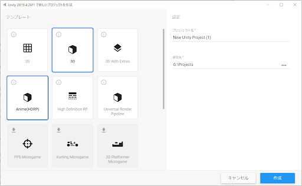

# **Unity Anime Toolbox**

1. [ホーム (日本語)](#ホーム)
1. [Home (English)](#home)

# ホーム

**Unity Anime Toolbox** は、Unityでアニメや映像を制作するための数々の機能を提供する包括的なパッケージです。

対応するバージョンおよびプラットフォーム：
1. Unity 2020.3.41f1 以降。
1. 主に Windows プラットフォーム。他のプラットフォームでは一部の機能が動作しないため。

# **始め方**

## **Unity Hub テンプレートからはじめる**

**Unity Anime Toolbox** には、Unity Hubから選択可能な形式に整えられた、各レンダーパイプラインに対応したテンプレートが同梱されています。

このテンプレートをご利用頂くことで、Unity Anime Toolboxの機能がインストールされた状態でUnityのプロジェクトを開始することが出来ます。
詳しくは [テンプレートのインストール方法](../../wiki/テンプレートのインストール方法)をご覧下さい。

> テンプレートがインストールされるとUnity Hubから**Anime**が選択可能になります。

[リリースページ](../../releases)の各バージョンに同梱されているテンプレート：
- HDRP: **com.unity.template.anime.hdrp-x.y.z.exp.tgz** 
- Universal RP: **com.unity.template.anime.urp-x.y.z.exp.tgz**
- Built-in: **com.unity.template.anime-x.y.z.exp.tgz**

## **サンプルプロジェクトからはじめる**

構築済みのプロジェクトから開始したい場合には、
[リリースページ](../../releases)の各バージョンに同梱されているサンプルプロジェクトからスタートすることも出来ます。

サンプルプロジェクトの詳細は[サンプルプロジェクトの Wiki](../../wiki/サンプルプロジェクト)をご覧下さい。

## バグの報告

バグを報告するには、[Issues ページで Issue を作成し](/../../issues/new?assignees=&labels=&template=bug_report.md&title=)、
詳細を記入してください。

# その他

* [主要パッケージ](../../wiki/主要パッケージ)

# ライセンス

**Unity Anime Toolbox** は個々のパッケージのコレクションであり、
それぞれに異なるライセンスと使用条件があります。 ライセンスの詳細については、各パッケージを確認してください。

--- 

# Home

Unity Anime Toolbox is a comprehensive package that provides a variety of features for creating video and animation in Unity.

Supported Versions and Platforms:
1. Unity 2020.3.41f1 and later.
1. Mainly Windows platform. Some features do not work in other platforms.

# **Getting Started**

## **Using a Unity Hub Template**

**Unity Anime Toolbox** comes with templates formatted for each render pipeline, which can be selected from the Unity Hub.

These templates can be used to start a new Unity project with Unity Anime Toolbox features installed.  
For details, please see [how to install templates](../../wiki/How-to-Install-Templates).

> Once the template is installed, **Anime** will be selectable from the Unity Hub.

Templates included in each version in the [Releases page](../../releases)：
- HDRP: **com.unity.template.anime.hdrp-x.y.z.exp.tgz**
- Universal RP: **com.unity.template.anime.urp-x.y.z.exp.tgz**
- Built-in: **com.unity.template.anime-x.y.z.exp.tgz**

## **Using a Sample Project**
If you want to start with a pre-built project, 
you can choose from one of the sample projects included in each version in the [Releases page](../../releases).

For details on the sample projects, please refer to [Sample Project Wiki](../../wiki/Sample-Projects).

## Bug Reports 

For reporting bugs, please [create an issue on the Issues page](/../../issues/new?assignees=&labels=&template=bug_report.md&title=) 
and fill in the details.

# Others

* [Main Packages](../../wiki/Main-Packages)

# License

Unity Anime Toolbox is a collection of individual packages, 
each with different licenses and terms of use. Please check each package for details on its license.

